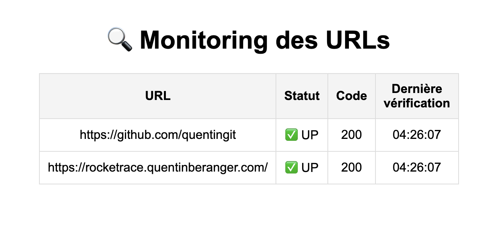

# Go Watchtower 🔭  



**Go Watchtower** est un **prototype simple** de monitoring d’URLs développé en **Go**, avec une interface web légère grâce à **HTMX**.  
Il permet de vérifier régulièrement l’état de plusieurs sites web et APIs, d'afficher les résultats en temps réel et d’enregistrer des logs.

## Fonctionnalités  

- 🌐 **Monitoring HTTP** des sites web et APIs avec `net/http`.  
- ⚡ **Exécution concurrente** des vérifications grâce aux **goroutines**.  
- 📡 **Interface web dynamique** avec **HTMX** (sans rechargement complet).  
- 📝 **Logs automatiques** des statuts dans `monitor.log`.  
- 🚀 **Prototype simple et rapide**, sans dépendances lourdes, écrit en **Go pur**.  

## Installation et utilisation  


### 1️⃣ Cloner le dépôt  
```sh
git clone https://github.com/votre-profil/go-watchtower.git
cd go-watchtower
```

2️⃣ Installer Go et initialiser le projet
```sh
go mod tidy
```

3️⃣ Modifier la configuration (urls.json)

```json
{
  "interval": 30, //votre temps d'intervalle 
  "urls": [
    "https://google.com", //vos sites ici
     ...
  ]
}
```

4️⃣ Lancer le monitoring

```sh
go run main.go
```

Le serveur tourne sur **http://localhost:8080** et met à jour l’interface toutes les 5 secondes (depuis la page htmx)
